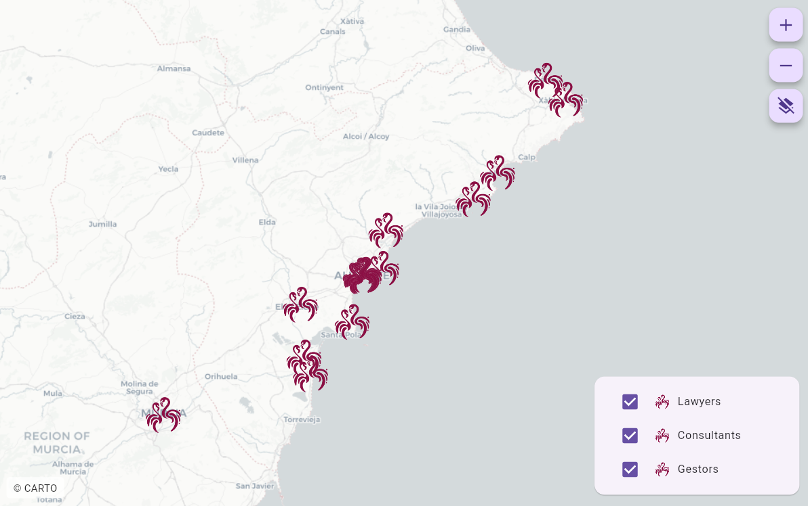
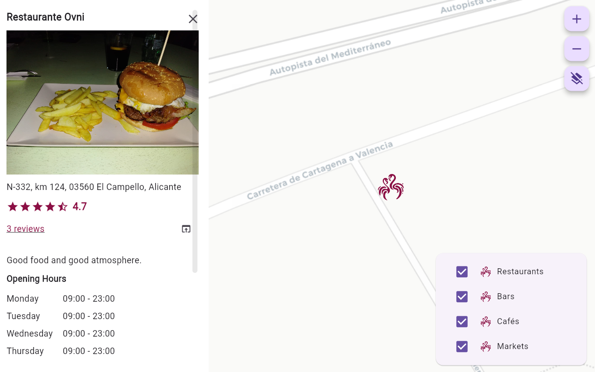

# map_web

Flutter project that displays clickable "directories" (markers) that open a side or bottom banner depending on the screen dimensions.

## Dependencies

The marker and category data is fetched from an API endpoint. There's an api folder created in the root directory containing an example of the backend service. There's also an sql folder that contains all the create statements for a working mvp .

## How to run

Update the endpoint calls to your hosted API and database. Then run the app with the flutters run command or build it and open the index.html in the "build".

## Screenshots

